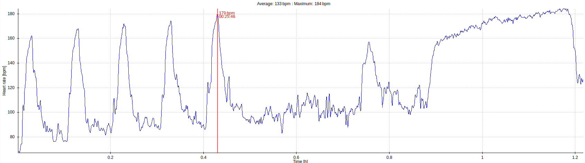

## Training for 2020 week 14

-------------------------------------------------------

Monday: 2020.03.30 
  - [x] fever.  Full rest. 

-------------------------------------------------------

Tuesday: 2020.03.31

  - [x] Meditation (Tara Brock - Radical Compassion)
  - [x] [Finger Prehab] personal modification (See below).
  - [x] steep face climbing 
    - 5x(1 min climb, 5 mins rest 22 degrees overhang, speed 22 feet per min.)
  - [x] enduro face climbing.
    - incline set to 5 degrees overhang, speed 22 feet per minute. 
    - [Couch to 5k]: week 5, day 2
      - 8m climb,  5m rest
      - 8m climb.
  - [x] Pull Up.  (work towards 5 sets, 5 reps) 

  - Notes:
    - kind of don't feel awful...
    - steep face climbing.  Nailed 22 degrees first attempt.  Try harder.
    - enduro face climbing.  was trying for full 20 mins.  didn't make it.  
    - I made myself a belt for my chalk bag.  so sporty. 

-------------------------------------------------------

Wednesday: 2020.04.01
  - [x] fever.  Full rest. 

-------------------------------------------------------

Thursday: 2020.04.02

  - [x] C25K w1 d1 aerobic climbing.
    - 8x(60s on, 90s off) 3 degrees slab, speed 18. 

  - [x] steep face climbing 
    - 5x(1 min climb, 5 mins rest 23 degrees overhang, speed 22 feet per min.)
  - [x] vertical crack climbing
    - incline set to 0 degrees (vertical), speed 18 feet per minute. 
    - [Couch to 5k]: week 6, day 2
      - by the book, it calls for 10 mins climb, 3 mins rest, 10 mins climb...
      - I climbed continuous 18 minutes.
  - [x] Pull Ups: 5 sets of 3 reps.  full bodyweight.
  - [ ] Heavy Finger Rolls progressions to 70 kgs
  - [x] Single Leg Squat to seated (seat height 20 inches (setting 25))

  - Notes:
    - first section of graph above shows HR during steep face climbing.  
    - second section of graph above shows HR during recovery rest. 
    - first section of graph above shows HR during vertical crack climbing.
    
-------------------------------------------------------

Friday:   2020.04.03
Saturday: 2020.04.04
Sunday:   2020.04.05

  - [ ] Build a garden, maybe. 
  
-------------------------------------------------------

[Finger Prehab] personal modification.
  - 1 dose collagen supplement, then wait 20 to 40 mins (i.e. meditate)
  - repeat 3 times: 
    - [Shoulder 5x5] with resistance band 
    - [Rotator Cuff 4x4] with resistance band 
    - rice bucket finger flexors and extensors x30
    - rice bucket wrist rolls x30 
    - 4x(large jug hang 10 seconds on, 5 seconds rest), 
    - gentle treadwall warmup: 1 min, 5 degrees overhang, speed 18 feet per minute. 

<!-- links -->
[Couch to 5k]: https://www.nhs.uk/live-well/exercise/couch-to-5k-week-by-week/
[Shoulder 5x5]: https://www.youtube.com/watch?v=al8t-V5tSS8
[Rotator Cuff 4x4]: https://www.youtube.com/watch?v=8GjxU_tp1-A
[Finger Prehab]: https://trainingforclimbing.com/climbing-training-protocol-for-stronger-finger-tendons-and-pulleys/

[Deadlifts]: https://www.youtube.com/watch?v=1ZXobu7JvvE&list=PLdWvFCOAvyr3EWQhtfcEMd3DVM5sJdPL4
[Heavy Finger Rolls]: http://nicros.com/training/training-articles/eastern-bloc-training-heavy-finger-rolls/

[Hangboarding - minimum edge protocol]: https://trainingforclimbing.com/4-fingerboard-strength-protocols-that-work/
