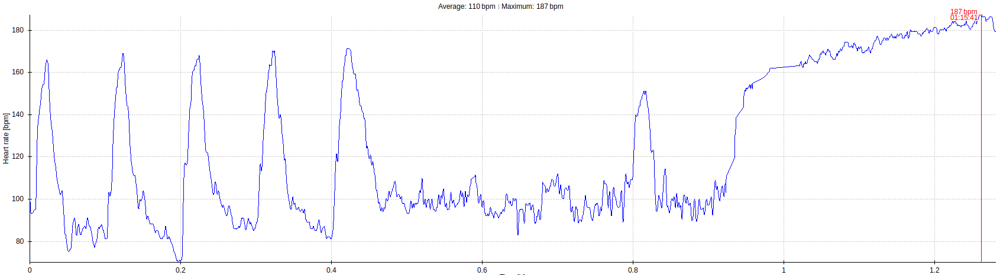

## Training for 2020 week 15
-------------------------------------------------------

Suday:     2020.04.05

  - Notes:  
    - poor sleep (Saturday night).  high anxiety.  
    - I was able to be supportive to a friend, but planed activities did not 
      happen.

-------------------------------------------------------

Monday:    2020.04.06

  - [x] Meditation (Tara Brock - Radical Compassion)
  - [x] my [Finger Prehab] warmups (See below).
  - [x] steep face climbing 
    - 5x(1 min climb, 5 mins rest 24 degrees overhang, speed 22 feet per min.)
  - [x] vertical crack climbing
    - incline set to 0 degrees (vertical), speed 18 feet per minute. 
    - [Couch to 5k]: week 7, day 1
    - Climb 25 mins.
  - [ ] Back Supported Dumbbell Press 
  - [ ] Pull Ups.  5 sets of 3 reps, focus on good form.

  - Notes:
    - poor sleep.  Room mates had TV on loud entire night.
    - steep face climb - this set felt properly hard.  Got this angle first
      try, but it was far from a given.  last set especially felt right at 
      the edge. 
    - vertical crack climbing 
      - Sooo hard.  Tried for 25 mins continous climbing, made it 22:04 seconds.
        Heart rate maxed out at 187 before I gave up.  For now, that's 
        respectable.  Next time try for 25 mins again.  try to hit a HR 
        of 188 or higher before giving up (if you simply must).  Do not increase 
        duration again untill you get 3 consecutive redpoints at 25 mins.
    - Body weight 162.4.  Weight loss has slowed to a more healthy pace. 

  
-------------------------------------------------------

Tuesday:   2020.04.07
  - [ ] Meditation (Tara Brock - Radical Compassion)
  - [ ] Sun Salutation Series A
  - [ ] Hamstring Stretching: 180 seconds daily dose
  - [ ] the [Mermaid Stretch] 
  - [ ] Door Jam Ankle Flexibility: 180 seconds daily dose
  - [ ] Single Leg Squat to seated  (seat height 20 inches (setting 25))
  - [ ] plank 90 seconds.  (+9s each workout, build up to 5 mins)

  - Notes:

-------------------------------------------------------

Wednesday: 2020.04.08
  - [ ] Meditation (Tara Brock - Radical Compassion)
  - [ ] my [Finger Prehab] warmups (See below).
  - [ ] steep face climbing 
    - 5x(1 min climb, 5 mins rest 25 degrees overhang, speed 22 feet per min.)
  - [ ] vertical crack climbing
    - incline set to 0 degrees (vertical), speed 18 feet per minute. 
    - [Couch to 5k]: week 7, day 2
    - Climb 25 mins.
  - [ ] Pull Ups.  5 sets of 3 reps, focus on good form.
  - [ ] Heavy Finger Rolls progressive sets to 70 kgs.
  - [ ] Bench Press 40 kgs.

  - Notes:

-------------------------------------------------------

Thursday:  2020.04.09
  - [ ] Meditation (Tara Brock - Radical Compassion)
  - [ ] Sun Salutation Series A
  - [ ] Hamstring Stretching: 180 seconds daily dose
  - [ ] the [Mermaid Stretch] 
  - [ ] Door Jam Ankle Flexibility: 180 seconds daily dose
  - [ ] Single Leg Squat to seated  (seat height 20 inches (setting 25))
  - [ ] plank 99 seconds.  (+9s each workout, build up to 5 mins)

  - Notes:

-------------------------------------------------------

Friday:    2020.04.10

  - [ ] Meditation (Tara Brock - Radical Compassion)
  - [ ] my [Finger Prehab] warmups (See below).
  - [ ] steep face climbing 
    - 5x(1 min climb, 5 mins rest 26 degrees overhang, speed 22 feet per min.)
  - [ ] vertical crack climbing
    - incline set to 0 degrees (vertical), speed 18 feet per minute. 
    - [Couch to 5k]: week 7, day 3
    - Climb 25 mins.
  - [ ] Pull Ups.  5 sets of 3 reps, focus on good form.
  - [ ] Back Supported Dumbbell Press 
  - [ ] Deadlift  65 kgs.

  
-------------------------------------------------------

Saturday:  2020.04.11
  - [ ] Meditation (Tara Brock - Radical Compassion)
  - [ ] Sun Salutation Series A
  - [ ] Hamstring Stretching: 180 seconds daily dose
  - [ ] the [Mermaid Stretch] 
  - [ ] Door Jam Ankle Flexibility: 180 seconds daily dose
  - [ ] Single Leg Squat to seated  (seat height 20 inches (setting 25))
  - [ ] plank 108 seconds.  (+9s each workout, build up to 5 mins)

  - Notes:

-------------------------------------------------------

[Finger Prehab] personal modification.
  - 1 dose collagen supplement, then wait 20 to 40 mins (i.e. meditate)
  - repeat 3 times: 
    - [Shoulder 5x5] with resistance band 
    - [Rotator Cuff 4x4] with resistance band 
    - rice bucket finger flexors and extensors x30
    - rice bucket wrist rolls x30 
    - 4x(large jug hang 10 seconds on, 5 seconds rest), 
    - gentle treadwall warmup: 1 min, 5 degrees overhang, speed 18 feet per minute. 

<!-- links -->
[Mermaid Stretch]: https://www.youtube.com/watch?v=094kY4GuhrE 
[Couch to 5k]: https://www.nhs.uk/live-well/exercise/couch-to-5k-week-by-week/
[Shoulder 5x5]: https://www.youtube.com/watch?v=al8t-V5tSS8
[Rotator Cuff 4x4]: https://www.youtube.com/watch?v=8GjxU_tp1-A
[Finger Prehab]: https://trainingforclimbing.com/climbing-training-protocol-for-stronger-finger-tendons-and-pulleys/

[Deadlifts]: https://www.youtube.com/watch?v=1ZXobu7JvvE&list=PLdWvFCOAvyr3EWQhtfcEMd3DVM5sJdPL4
[Heavy Finger Rolls]: http://nicros.com/training/training-articles/eastern-bloc-training-heavy-finger-rolls/

[Hangboarding - minimum edge protocol]: https://trainingforclimbing.com/4-fingerboard-strength-protocols-that-work/
